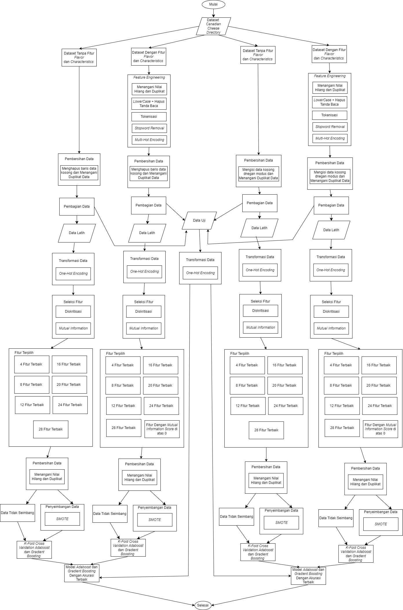

# Adaboost-vs-GradientBoosting-Cheese-Fat

Membandingkan performa Adaboost dan Gradient Boosting untuk klasifikasi kadar lemak keju dengan Feature Engineering, SMOTE dan strategi penanganan data hilang

## Dataset

Dataset yang digunakan dalam proyek ini adalah **"Canadian Cheese Directory"** yang bersumber dari Kaggle.

- **Sumber:** [Canadian Cheese Directory Dataset on Kaggle](https://www.kaggle.com/datasets/noahjanes/canadian-cheese-directory)
- **Deskripsi:** Dataset ini berisi 10 fitur untuk klasifikasi kadar lemak pada keju. Diantaranya 1 numerik kontinu, 2 data teks, 7 kategorikal.

## Diagram Alur Penelitian

Berikut adalah alur kerja yang dilakukan dalam penelitian ini:

