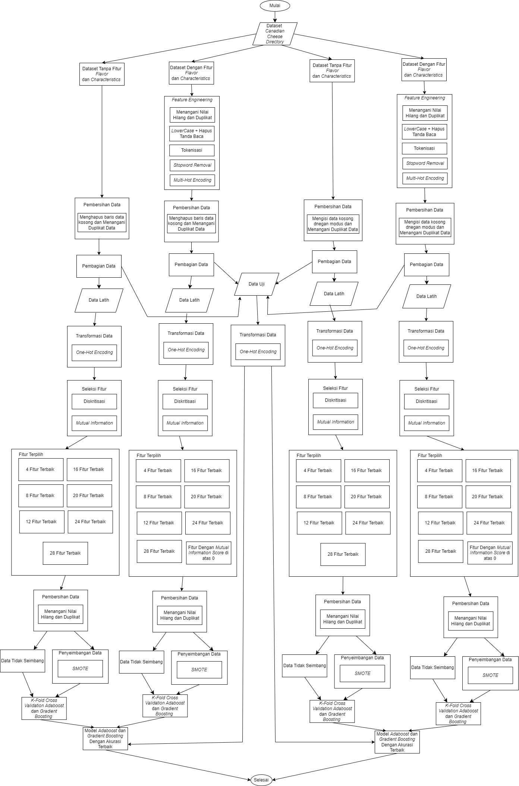

# Adaboost-vs-GradientBoosting-Cheese-Fat
Membandingkan performa Adaboost dan Gradient Boosting untuk klasifikasi kadar lemak keju dengan Feature Engineering, SMOTE dan strategi penanganan data hilang
## Diagram Alur Penelitian
Berikut adalah alur kerja yang dilakukan dalam penelitian ini:

